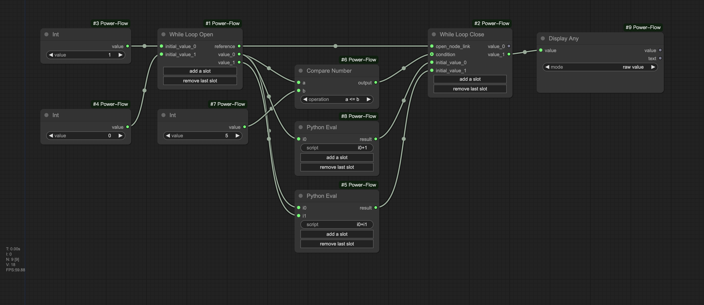
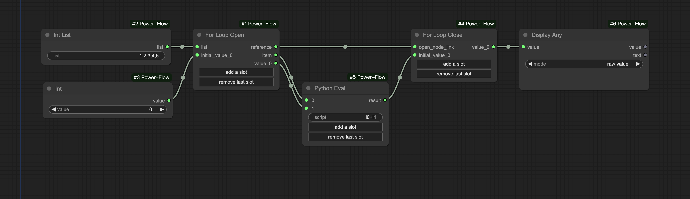
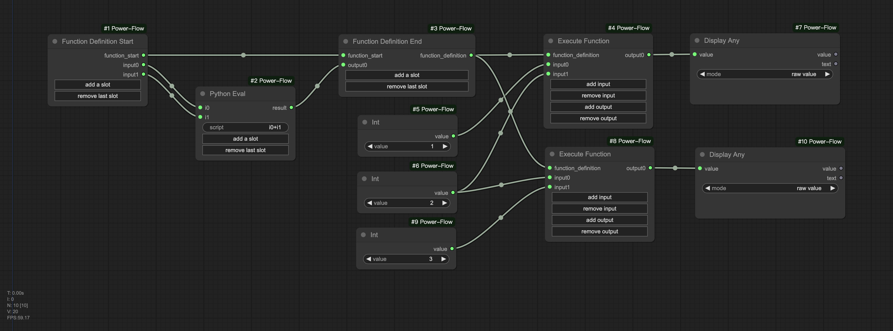
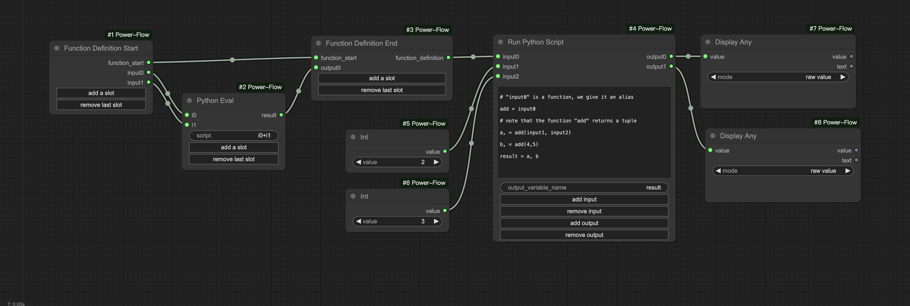
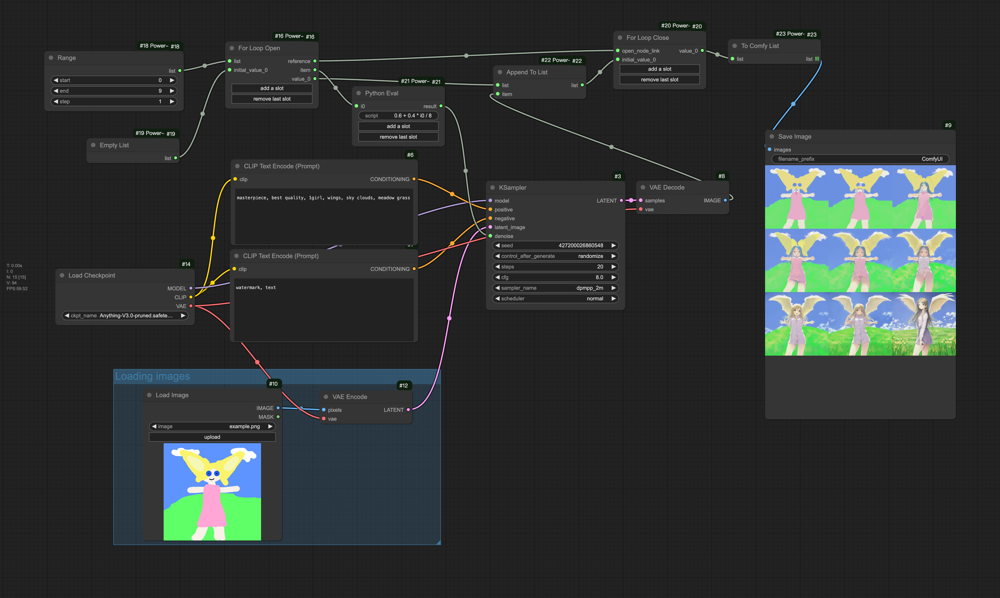
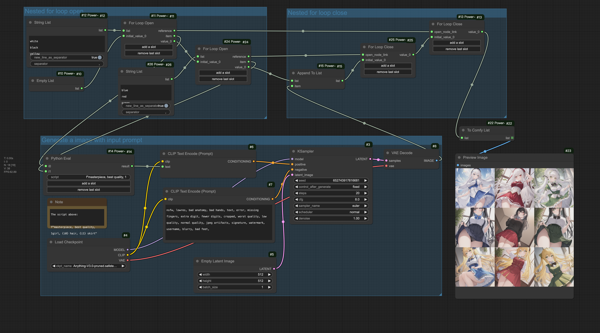
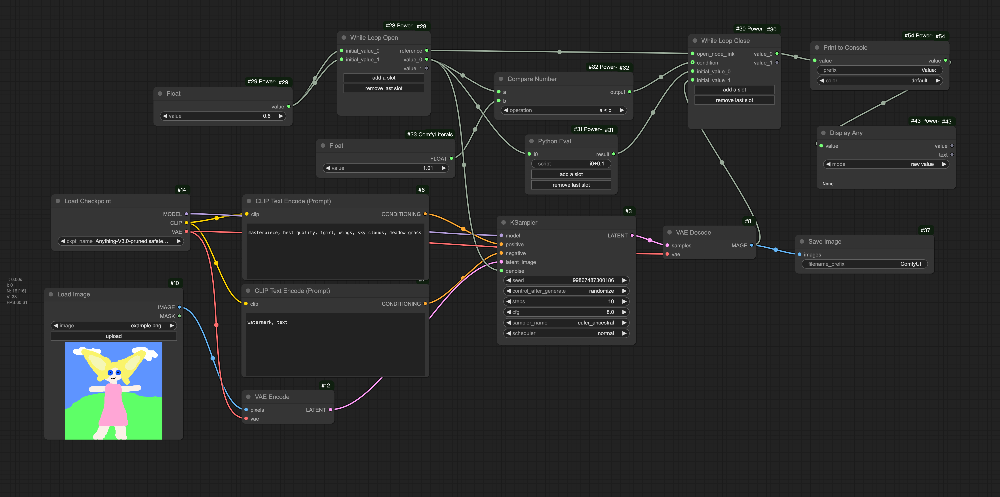
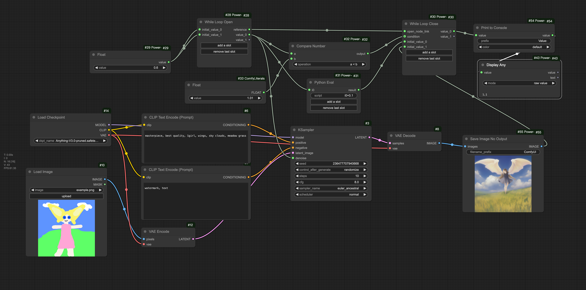

[中文](./docs/README_CN.md)

A ComfyUI node package that introduces common programming logic to enhance the flexibility of ComfyUI workflows. It supports features such as function definition and execution, "for" loops, "while" loops, and Python code execution.

# Quick Overview of Core Features
## While Loop
The following example demonstrates how to calculate the sum of integers from 1 to 5. Nodes placed between **"While Loop Open"** and **"While Loop Close"** will be executed repeatedly. The values passed to "value_0" and "value_1" in the previous iteration will be used as "initial_value_0" and "initial_value_1" in the next iteration.

## For Loop
This example calculates the sum of integers from 1 to 5. Nodes between **"For Loop Open"** and **"For Loop Close"** will be executed multiple times. The **"For Loop Open"** node retrieves one element from the input list during each iteration and outputs it through the "item" slot.

## Function Call
In the workflow below, a function is defined between **"Function Definition Start"** and **"Function Definition End"** to add two integers. The function is then called twice with different parameters, and the results are output.

## Execute Python Code
The **"Run Python Script"** node allows you to execute arbitrary Python code. You can even define a function in the workflow and call it within the Python script.
Here’s an example of executing Python code. The script receives a function defined in the workflow (which adds two numbers) as "input0", along with two integers as "input1" and "input2". It then executes "input0(input1, input2)" and "input0(4, 5)", outputting the results to "output0" and "output1", respectively.
**Note:** The "Run Python Script" node can accept any code. If your ComfyUI is deployed on the public internet and not just for your own use, please consider security implications.

## Other Features
You can find more examples under the directory "docs/example-workflows"

# Installation
Enter your ComfyUI custom_nodes directory and execute the following command:
"""bash
git clone https://github.com/x3bits/ComfyUI-Power-Flow.git
"""

# Examples
To make it easier to understand, the examples in the section "Quick Overview of Core Features" did not use the common nodes of ComfyUI to generate images. Here are some examples to show how this package can be used in your workflow to generate images.

Here is an example of trying different "denoise" value of KSampler.

Here is an example to draw 9 girls with different hair and skirt color combinations (white/black/yellow hair with blue/red/green skirt). It uses nested "For Loop" to iterate through all combinations.

# Known Limitations
Using output nodes between **"Function Definition Start"** and **"Function Definition End"**, **"For Loop Open"** and **"For Loop Close"**, or **"While Loop Open"** and **"While Loop Close"** is not supported. This may lead to unexpected behavior.
"Save Image", "Preview Image" are the most common output nodes. For example, in the workflow below, we intend to save a image in each loop, but in fact, the "Save Image" node will block the workflow.

To fix the problem, you can use the "Save Image No Output" and "Preview Image No Output" nodes provided by this package. These nodes have the same function as the original nodes, but they are not output nodes. Don't forget to connect the output of the "Save Image No Output" or "Preview Image No Output" node to the loop close node or function end node to make them executed.

# How It Works
This project was inspired by [https://github.com/BadCafeCode/execution-inversion-demo-comfyui](https://github.com/BadCafeCode/execution-inversion-demo-comfyui). The project uses the "node expansion" feature of ComfyUI to dynamically generate new nodes during workflow execution. You can learn more about "node expansion" [here](https://docs.comfy.org/essentials/custom_node_expansion).