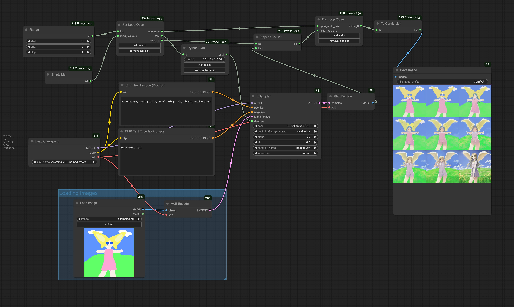
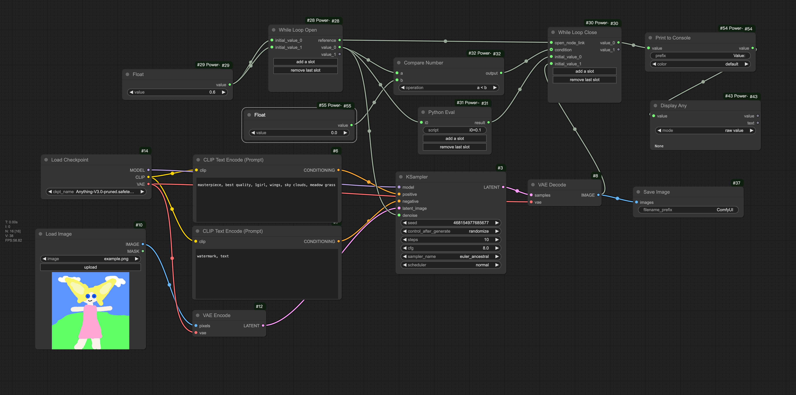

一个包含常见编程逻辑的ComfyUI节点包，旨在使ComfyUI工作流更加灵活。它支持函数定义与执行、for循环、while循环以及Python代码执行等编程逻辑。

# 核心功能概览
## While循环
以下是一个计算从1到5的整数和的演示。位于"While Loop Open"和"While Loop Close"之间的节点将被多次执行。前一次循环中输入的"value_0"和"value_1"值将作为下一次循环的"initial_value_0"和"initial_value_1"输入。


## For循环
以下是一个计算从1到5的整数和的演示。位于"For Loop Open"和"For Loop Close"之间的节点将被多次执行。"For Loop Open"节点每次从输入列表中取出一个元素，并在"item"这个输出节点输出。


## 函数调用
在下面的工作流中，我们在"Function Definition Start"和"Function Definition End"之间定义了一个将两个整数相加的函数。然后我们用不同的参数调用了它两次，并输出结果。


## 执行Python代码
使用"Run Python Script"节点，您可以执行任何Python代码。您甚至可以在工作流中定义一个函数，并在Python代码中调用它。

以下是一个执行Python代码的示例。它接收工作流中定义的一个将两个数字相加的函数作为"input0"，接收两个整数作为"input1"和"input2"，并执行"input0(input1, input2)"和"input0(4, 5)"，将结果分别输出到"output0"和"output1"。

**注意：** "Run Python Script"节点可以接受任何代码。如果您的ComfyUI部署在公联网上，而不仅仅是供自己使用，请考虑安全性问题。


## 其他功能
您可以在"docs/example-workflows"目录下找到更多示例。

# 安装
进入您的ComfyUI custom_nodes目录并执行以下命令：

```bash
git clone https://github.com/x3bits/ComfyUI-Power-Flow.git
```

# 示例
为了便于理解，"核心功能概览"部分中的示例没有使用ComfyUI的常见节点来生成图像。以下是一些示例，展示了如何在生成图像的工作流中使用这个节点包。

以下是一个尝试不同KSampler"denoise"值的示例。


以下是一个绘制9个不同头发和裙子颜色组合的女孩的示例（白色/黑色/黄色头发与蓝色/红色/绿色裙子）。它使用嵌套的"For循环"来遍历所有组合。


# 已知限制
不支持在"Function Definition Start"和"Function Definition End"、"For Loop Open"和"For Loop Close"或"While Loop Open"和"While Loop Close"之间使用输出节点。这可能会导致不可预料的行为。

ComfyUI中最常见的输出节点大概就是"Save Image"、"Preview Image"这两个节点。例如，在下面的工作流中，我们试图在每次循环中保存一张图像，但实际上，"Save Image"节点并不会执行，甚至会阻塞后续的工作流。


要解决此问题，您可以使用此包提供的"Save Image No Output"和"Preview Image No Output"节点。这些节点具有与原始节点相同的功能，但它们不是输出节点。别忘了将"Save Image No Output"或"Preview Image No Output"节点的输出连接到循环结束节点或函数结束节点，以确保它们能够被执行。


# 工作原理
该项目灵感来源于[https://github.com/BadCafeCode/execution-inversion-demo-comfyui](https://github.com/BadCafeCode/execution-inversion-demo-comfyui)。本项目使用了ComfyUI的"节点扩展"功能在工作流执行期间动态生成新节点。您可以在[此处](https://docs.comfy.org/essentials/custom_node_expansion)了解更多关于"节点扩展"的信息。